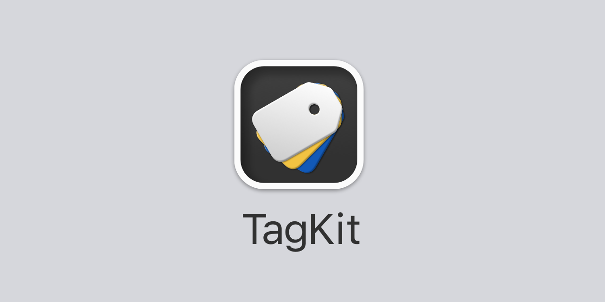
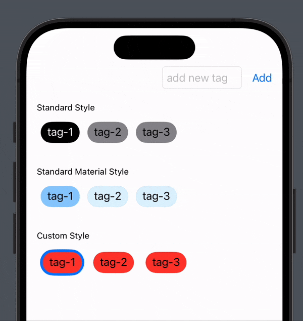

<p align="center">
    
</p>

<p align="center">
    
    
    
    <a href="https://twitter.com/danielsaidi">
        
    </a>
</p>


## About TagKit

TagKit makes it easy to work with tags in `Swift` and `SwiftUI`.

The result can look like this or completely different: 

<p align="center">
    
</p>

Tags and tag presenting views can be customized to fit your specific needs. You can change the tag format and use any custom models. When presenting tags, you can change colors, fonts, corner radius etc. and use any views you like.


## Supported Platforms

TagKit supports `iOS 13`, `macOS 11`, `tvOS 13` and `watchOS 6`.


## Installation

TagKit can be installed with the Swift Package Manager:

```
https://github.com/danielsaidi/TagKit.git
```

or with CocoaPods:

```
pod TagKit
```


## Getting started

To get started with Tag, have a look at [this getting started guide][GettingStarted].


## Documentation

The [online documentation][Documentation] contains more information, code examples etc. and makes it easy to overview the various parts of the library.

The online documentation is currently iOS-specific. To generate documentation for other platforms, open the package in Xcode, select a simulator then run `Product/Build Documentation`. 


## Demo Application

I will create a demo application for this package once it gets 100+ stars.


## Support

You can sponsor this project on [GitHub Sponsors][Sponsors] or get in touch for paid support. 


## Contact

Feel free to reach out if you have questions or if you want to contribute in any way:

* E-mail: [daniel.saidi@gmail.com][Email]
* Twitter: [@danielsaidi][Twitter]
* Web site: [danielsaidi.com][Website]


## License

TagKit is available under the MIT license. See the [LICENSE][License] file for more info.


[Email]: mailto:daniel.saidi@gmail.com
[Twitter]: http://www.twitter.com/danielsaidi
[Website]: http://www.danielsaidi.com
[Sponsors]: https://github.com/sponsors/danielsaidi

[Documentation]: https://danielsaidi.github.io/TagKit/documentation/tagkit/
[GettingStarted]: https://github.com/danielsaidi/TagKit/blob/master/Readmes/Getting-Started.md
[License]: https://github.com/danielsaidi/TagKit/blob/master/LICENSE

[Tutorial]: https://www.swiftcompiled.com/swiftui-cards/
