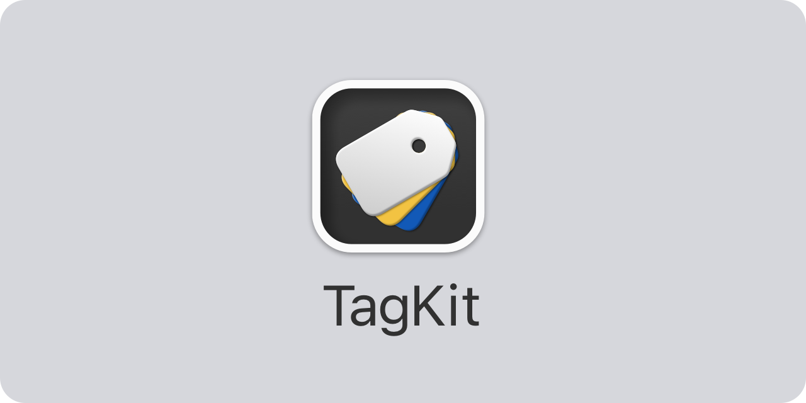

<p align="center">
    
</p>

<p align="center">
    
    
    
    
        <a href="https://twitter.com/danielsaidi">
        
    </a>
    <a href="https://mastodon.social/@danielsaidi">
        
    </a>
</p>


## About TagKit

TagKit is a Swift SDK that makes it easy to work with tags and slugification in `Swift` and `SwiftUI`. 

The result can look like this or completely different: 

<p align="center">
    
</p>

Tags and views can be customized to fit your specific needs. You can change the slug format and tag any custom models. When presenting tags, you can apply custom styling and use any views you like.


## Installation

TagKit can be installed with the Swift Package Manager:

```
https://github.com/danielsaidi/TagKit.git
```


## Getting started

The [online documentation][Documentation] has a [getting-started guide][Getting-Started] that helps you get started with TagKit.


## Documentation

The [online documentation][Documentation] has more information, articles, code examples, etc. 


## Demo Application

I will create a demo application for this package once it gets 100+ stars.


## Support this library

You can [sponsor me][Sponsors] on GitHub Sponsors or [reach out][Email] for paid support, to help support my [open-source projects][OpenSource].

Your support makes it possible for me to put more work into these projects and make them the best they can be.


## Contact

Feel free to reach out if you have questions or if you want to contribute in any way:

* Website: [danielsaidi.com][Website]
* Mastodon: [@danielsaidi@mastodon.social][Mastodon]
* Twitter: [@danielsaidi][Twitter]
* E-mail: [daniel.saidi@gmail.com][Email]


## License

TagKit is available under the MIT license. See the [LICENSE][License] file for more info.


[Email]: mailto:daniel.saidi@gmail.com

[GitHub]: https://github.com/danielsaidi
[Twitter]: https://twitter.com/danielsaidi
[Mastodon]: https://mastodon.social/@danielsaidi
[OpenSource]: https://danielsaidi.com/opensource
[Sponsors]: https://github.com/sponsors/danielsaidi

[Documentation]: https://danielsaidi.github.io/TagKit/documentation/tagkit/
[Getting-Started]: https://danielsaidi.github.io/TagKit/documentation/tagkit/getting-started

[License]: https://github.com/danielsaidi/TagKit/blob/master/LICENSE
