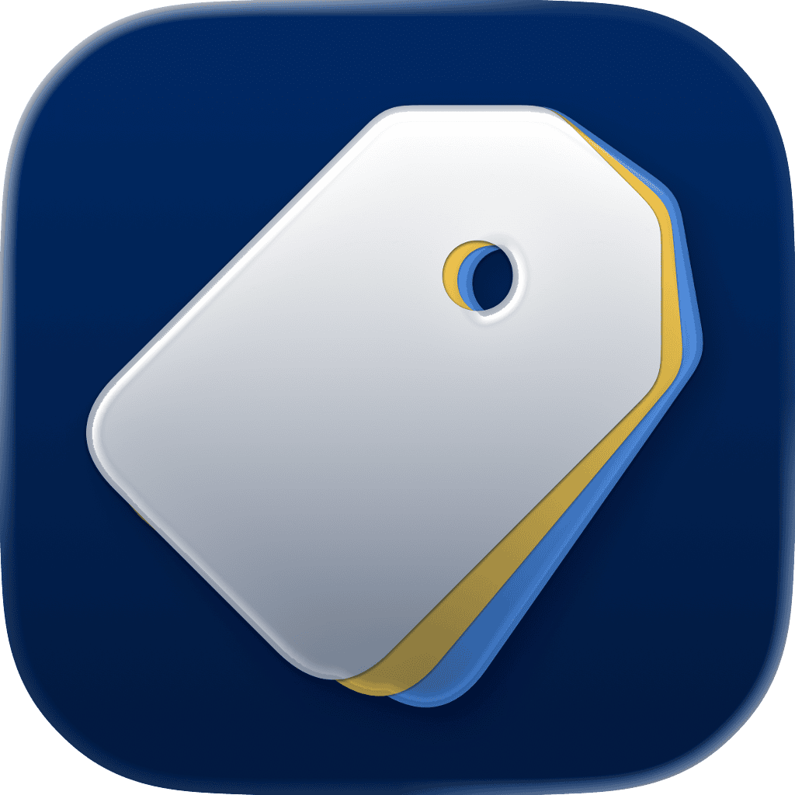

<p align="center">
    
</p>

<p align="center">
    
    
    
    <a href="https://danielsaidi.github.io/TagKit"></a>
    <a href="https://github.com/danielsaidi/TagKit/blob/master/LICENSE"></a>
    <a href="https://github.com/sponsors/danielsaidi"></a>
</p>


# TagKit

TagKit is a library that makes it easy to use tags and slugify strings in Swift and SwiftUI.

<p align="center">
    
</p>

You can slug and tag any type, customize the slug format, and use the built-in views to list and edit tags with ease.


## Installation

TagKit can be installed with the Swift Package Manager:

```
https://github.com/danielsaidi/TagKit.git
```


## Support My Work

You can [become a sponsor][Sponsors] to help me dedicate more time on my various [open-source tools][OpenSource]. Every contribution, no matter the size, makes a real difference in keeping these tools free and actively developed.


## Getting started

TagKit lets you slugify strings and manage tags for any taggable type.


### Slugs

Slugifying a string means to remove unwanted characters and replacing whitespaces with a separator. This is often used in urls, where a page slug creates a unique, valid url that also describes the content.

TagKit has a ``Swift/String/slugified(with:)`` string extension that lets you slugify strings with a standard or custom ``SlugConfiguration``:

```
let custom = SlugConfiguration(
    separator: "+",
    allowedCharacters: .init(charactersIn: "hewo")
)

"Hello, world!".slugified()             // "hello-world" 
"Hello, world!".slugified(with: custom) // "he+wo"
```

Slugified strings are automatically lowercased, since a slug should be case-insensitively unique.


### Tags

Tagging is the process of adding tags to an item, with the intent to categorize, group, filter and search among tags.

TagKit has a ``Taggable`` protocol that can be implemented by any type that has mutable ``Taggable/tags``:

```swift
public protocol Taggable {

    var tags: [String] { get set }
}
```

Once a type implements ``Taggable``, it can make use of a lot of automatically implemented functionality that the protocol provides, like ``Taggable/hasTags``, ``Taggable/slugifiedTags``, ``Taggable/addTag(_:)``, ``Taggable/removeTag(_:)``, ``Taggable/toggleTag(_:)``. All ``Taggable`` collections are extended as well.


### Views

TagKit has a couple of tag related views, like ``TagList``, ``TagEditList`` and ``TagTextField``.


## Documentation

The online [documentation][Documentation] has more information, articles, code examples, etc.


## Contact

Feel free to reach out if you have questions or if you want to contribute in any way:

* Website: [danielsaidi.com][Website]
* E-mail: [daniel.saidi@gmail.com][Email]
* Bluesky: [@danielsaidi@bsky.social][Bluesky]
* Mastodon: [@danielsaidi@mastodon.social][Mastodon]


## License

TagKit is available under the MIT license. See the [LICENSE][License] file for more info.


[Email]: mailto:daniel.saidi@gmail.com
[Website]: https://danielsaidi.com
[GitHub]: https://github.com/danielsaidi
[OpenSource]: https://danielsaidi.com/opensource
[Sponsors]: https://github.com/sponsors/danielsaidi

[Bluesky]: https://bsky.app/profile/danielsaidi.bsky.social
[Mastodon]: https://mastodon.social/@danielsaidi
[Twitter]: https://twitter.com/danielsaidi

[Documentation]: https://danielsaidi.github.io/TagKit
[License]: https://github.com/danielsaidi/TagKit/blob/master/LICENSE
